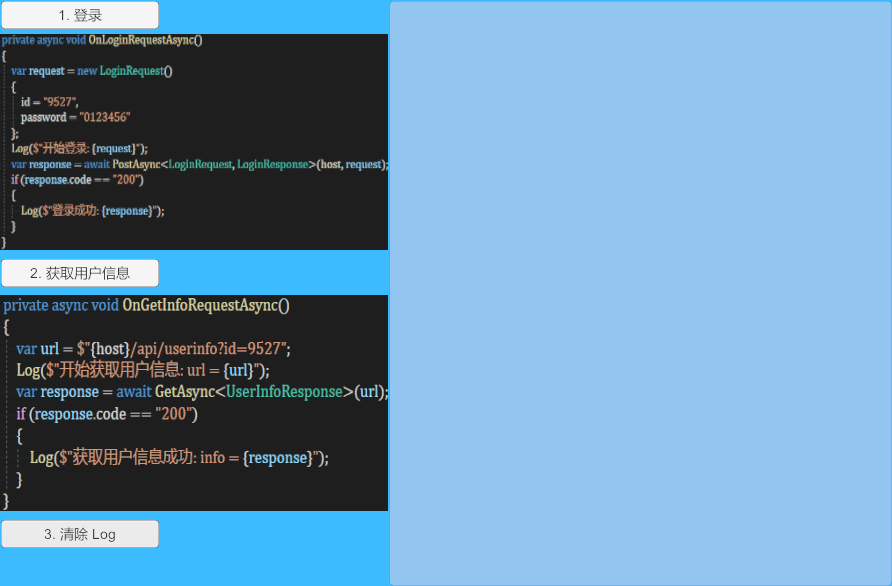

# Async Web Request


使用 Task + UnityWebRequest 实现的 RPC 风格的 await/async UnityWebRequest 扩展。


An RPC-style await/async UnityWebRequest extension implemented using Task + UnityWebRequest.


这是一个极其简约、优雅的实现，你可以开箱即食，也可以拿来学习哦， 当然，闻道有先后，达者为师，如有异议愿闻其详~


This is an extremely simple and elegant implementation. You can use it right out of the box, or you can use it for learning. Of course, there is a sequence to understanding things, and those who have achieved success are the teachers. If you have any objections, I would like to hear the details.

# Post请求

```csharp
        private async void OnLoginRequestAsync()
        {
            var request = new LoginRequest()
            {
                id = "9527",
                password = "0123456"
            };
            Log($"开始登录: {request}");
            var response = await PostAsync<LoginRequest, LoginResponse>(host, request);
            if (response.code == "200")
            {
                Log($"登录成功: {response}");
            }
        }
```

这个示例代码使用 await PostAsync 实现 **“同步”** 获取到服务器数据。


# GetAsync 请求

```csharp
        private async void OnGetInfoRequestAsync()
        {
            var url = $"{host}/api/userinfo?id=9527";
            Log($"开始获取用户信息: url = {url}");
            var response = await GetAsync<UserInfoResponse>(url);
            if (response.code == "200")
            {
                Log($"获取用户信息成功: info = {response}");
            }
        }
```

这个示例代码使用 QueryString + Get 实现通过 await  **“同步”**  Get 获取到服务器数据


# 示例动画





# UniWebServer

内置简易 WebServer ，但此 Server 组件仅供测试，请勿用于生产环境！


# 关于 WebGL 适配

* 你可以使用 [GitHub - Cysharp/UniTask](https://github.com/Cysharp/UniTask) 替换 Task 实现在 WebGL 中使用

* 你也可以使用 [GitHub - VolodymyrBS/WebGLThreadingPatcher](https://github.com/VolodymyrBS/WebGLThreadingPatcher) Hack Task ，实现 Task 在 WebGL 中使用 (笔者未验证)


